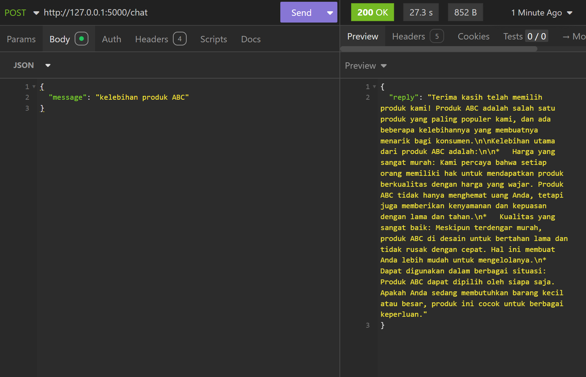

## Instalasi Repositori
git clone https://github.com/jordyyusim/chatbot-ollama.git

## Instalasi Dependensi
pip install -r requirements.txt

## Database
### Tabel: Conversation
| Kolom      | Tipe Data      | Keterangan                     |
|------------|----------------|--------------------------------|
| id         | INTEGER        | Primary Key, auto increment    |
| message    | TEXT           | Pertanyaan user                |
| reply      | TEXT           | Balasan bot                    |
| timestamp  | Datetime       | Waktu dibuat, current timestamp|

### Tabel: Orders
| Kolom      | Tipe Data      | Keterangan                     |
|------------|----------------|--------------------------------|
| id         | INTEGER        | Primary key, auto increment    |
| username   | TEXT           | Nama User                      |
| order_id   | TEXT           | Nomor order, unique            |
| product    | TEXT           | Nama produk                    |
| status     | TEXT           | Status pesanan                 |

### Tabel: Products
| Kolom               | Tipe Data      | Keterangan            |
|---------------------|----------------|-----------------------|
| product_id          | INTEGER        | Id produk, primary key|
| product_name        | TEXT           | Nama produk           |
| product_description | TEXT           | Deskripsi produk      |

### Tabel: Faqs
| Kolom      | Tipe Data      | Keterangan                     |
|------------|----------------|--------------------------------|
| id         | INTEGER        | Primary Key, Auto Increment    |
| question   | TEXT           | Pertanyaan sering muncul       |
| answer     | TEXT           | Jawaban dari pertanyaan        |

## Framework & Library 
1. Flask => Untuk membuat REST API
2. Sqlite3 => Untuk database lokal dengan tabel `Conversation`, `Orders`, `Products`, `Faqs`
3. Langchain
- ChatOllama => Untuk pakai ollama secara lokal
- ConversationBufferWindowMemory => Untuk menyimpan memori percakapan
- LLMChain => Untuk membuat chain llm
- ChatPromptTemplate => Untuk template prompt
- OllamaEmbeddings => Untuk membuat embedding lokal
- Document => Untuk vectorstore untuk RAG
- FAISS => Untuk merepresentasikan dokumen dengan metadata
- CharacterTextSplitter => Untuk memecah text panjang untuk di-embedding
4. Pickle => Untuk menyimpan vector ke lokal
5. os => *Disini untuk mengecek file apakah sudah ada atau belum 
6. re => Untuk mengecek keyword

## Model LLM 
` llama3.2:3b`

## Daftar Pertanyaan Yang Dapat Dijawab
1. Status Pesanan
2. Kelebihan Produk
3. Cara Klaim Garansi
4. Metode Pembayaran

## Daftar Tool Call
1. Status Pesanan Produk "xxxxxxx" (cth: TKJY001)

## Screenshots

